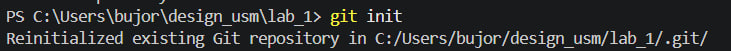
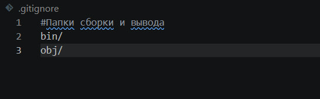
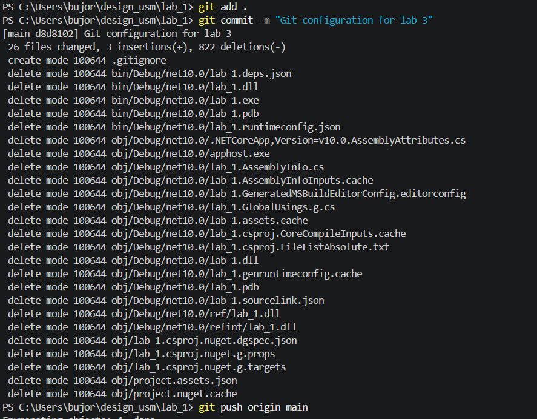
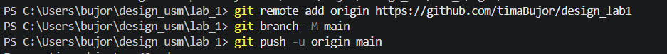

# Лабораторная работа №1

**Тема:** Установка и настройка среды разработки .NET.

## Задания и выполнение

### 1. Установка .NET
Установил пакет SDK .NET на локальный компьютер для разработки кроссплатформенных приложений.

### 2. Проверка установки
Открыл терминал и убедился, что команда `dotnet` доступна в системе и отображает текущую версию.

### 3. Создание проекта
Инициализировал новый C# проект типа Console Application через командную строку.

### 4. Запуск приложения
Скомпилировал исходный код и запустил программу с помощью команды `dotnet run`. Программа успешно вывела результат в консоль.

# Лабораторная работа №2

**Тема:**  Понимание базового проекта.

## Задания и выполнение

### 1. Компилирование 
Попытка запуска программы без компиляции

Воссоздаем файлы

Запускаем файл полученный в папке bin в ходе компиляции

### 2. Базовые инструкции
Напечатать Hello, Jerry в консоль

Создание функции печатающей Буквы с таймаутом

Создайте 3 функции (A, B, C). Вызовите функции B и C в функции A. Вызовите функцию A в основной программе несколько раз.

4 Что будет если функцию нигде не вызвать? Выполнится ли она все равно, и когда, если да?

Функция не выполнится 

5 Важен ли порядок определения функций? Возможно ли сослаться из функции, определенной раньше в файле, к функции, определенной после? Попытайтесь это сделать?

Компилятор анализирует все файлы класса перед генерацией исполняемого кода, так что ему не важен порядок нахождение функции внутри класса

# Лабораторная работа №3

**Тема:**  Настройка git.

## Задания и выполнение

### 1. Инициализируйте git репозиторию для вашего проекта (или для папки, содержащей проект) (команда git init). 

### 2. Добавьте файл .gitignore, в котором игнорируйте временные или сгенерированные при компиляции файлы.

### 3. Сделайте коммит

### 4. Свяжите локальную репозиторию с удаленной

# Лабораторная работа №4
**Тема:**  Базовое взаимодействие с памятью через переменные.
## Задания и выполнение

Объясните, что произойдет в следующих отрезках кода:

* Какие выполнятся инструкции и как,
* Сколько ячеек памяти выделится во временной памяти,
* Какое значение куда запишется,
* Сколько объектов выделится в динамической памяти,
* Что будет в переменных по итогу выполнения программы,
* Что напечатается в консоль.

### 1. Присваивание одной переменной к другой. 

1. Инструкции: int a = 5; -  в этой строке происходит выделение памяти под переменную (а) и присвоение ей значения (5)
2. В времянной памяти выделяется 1 ячейка под каждую переменную, тк это int - выделится 4 байта памяти
3. Какое значение куда запишется
* int a = 5; — в ячейку a записывается 5.
* int b = 6; — в ячейку b записывается 6.
* a = b; — значение из ячейки b (6) копируется и записывается в ячейку a. Теперь a хранит 6.
* b = 7; — в ячейку b вместо 6 записывается 7. Переменная a при этом никак не меняется, так как они независимы.
4. 0 объектов. Значимые типы данных вроде int хранятся непосредственно там, где они были объявлены (в данном случае — на стеке)
5. В переменной a будет значение 6. В переменной b будет значение 7.
6. В консоль напечатается "6"

### 2. Присваивание выражения, включающего переменную

1. Какие инструкции выполнятся и как
* В стеке выделяется память под a, туда записывается число 5.
* Программа вычисляет выражение a + 6 (подставляет текущее значение 5 + 6 = 11), выделяет память под b и записывает туда результат — 11.
* В переменную a перезаписывается новое значение 7 (старое значение 5 стирается).
* Метод Console.WriteLine считывает значение из b и выводит его.
2. Также выделится 2 ячейки по 1 на каждую переменную
3. Какое значение куда запишется:
* int a = 5; — в a записывается 5.
* int b = a + 6; — в b записывается результат вычисления 11.
* a = 7; — в a записывается 7. Переменная b при этом не меняется, так как связь между ними после вычисления первой строчки отсутствует.
4. 0 объектов. Значимые типы данных вроде int хранятся непосредственно там, где они были объявлены (в данном случае — на стеке)
5. В переменной a будет значение 7. В переменной b будет значение 11.
6. В консоле выведется значение переменной b - 11

### 3. Присваивание ссылочной переменной

