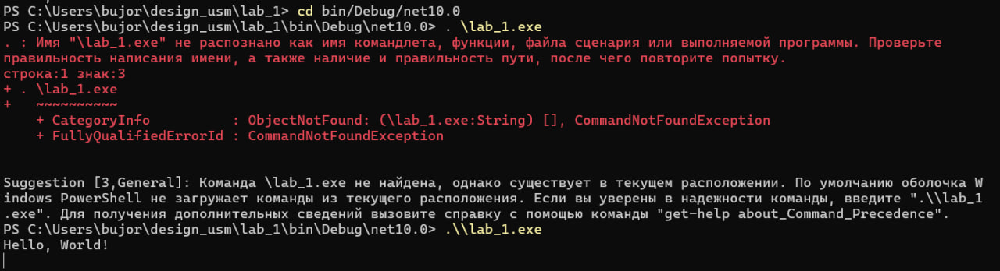
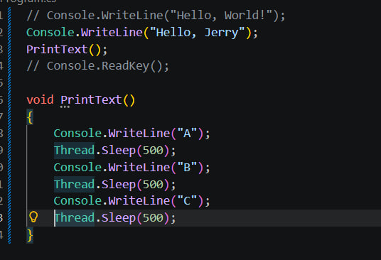
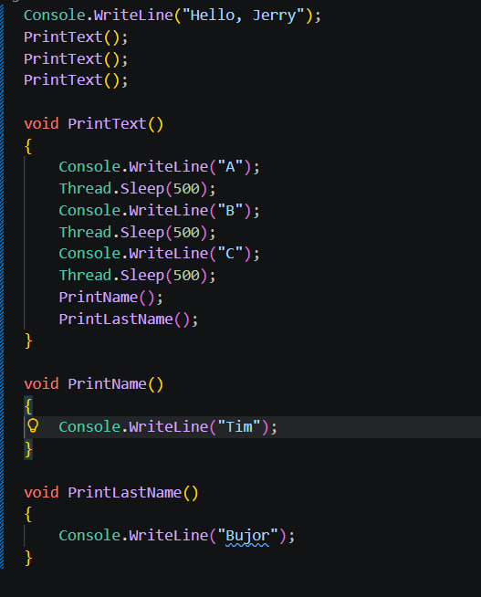

# Лабораторная работа №1

**Тема:** Установка и настройка среды разработки .NET.

## Задания и выполнение

### 1. Установка .NET
Установил пакет SDK .NET на локальный компьютер для разработки кроссплатформенных приложений.

### 2. Проверка установки
Открыл терминал и убедился, что команда `dotnet` доступна в системе и отображает текущую версию.

### 3. Создание проекта
Инициализировал новый C# проект типа Console Application через командную строку.

### 4. Запуск приложения
Скомпилировал исходный код и запустил программу с помощью команды `dotnet run`. Программа успешно вывела результат в консоль.

# Лабораторная работа №2

**Тема:**  Понимание базового проекта.

## Задания и выполнение

### 1. Компилирование 
Попытка запуска программы без компиляции

Воссоздаем файлы

Запускаем файл полученный в папке bin в ходе компиляции

### 2. Базовые инструкции
Напечатать Hello, Jerry в консоль

Создание функции печатающей Буквы с таймаутом

Создайте 3 функции (A, B, C). Вызовите функции B и C в функции A. Вызовите функцию A в основной программе несколько раз.

4 Что будет если функцию нигде не вызвать? Выполнится ли она все равно, и когда, если да?

Функция не выполнится 

5 Важен ли порядок определения функций? Возможно ли сослаться из функции, определенной раньше в файле, к функции, определенной после? Попытайтесь это сделать?

Компилятор анализирует все файлы класса перед генерацией исполняемого кода, так что ему не важен порядок нахождение функции внутри класса

